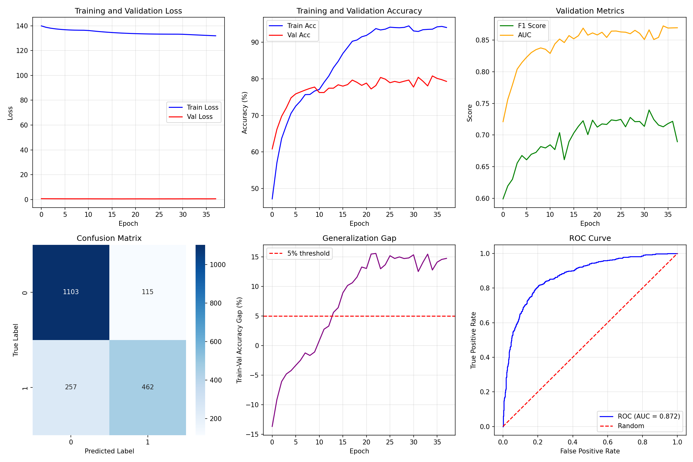

# Multi-Modal Breast Cancer Classification using EfficientNet

[](https://www.python.org/downloads/)
[](https://pytorch.org/)
[](https://opensource.org/licenses/MIT)

A deep learning pipeline combining image features from mammograms with tabular clinical data for improved breast cancer detection. This implementation uses a multi-modal architecture with EfficientNet-B0 as the image encoder and achieves strong performance on the Mini-DDSM dataset.

## 🔬 Project Overview

This project implements a **multi-modal deep learning approach** that fuses:
- **Image features** extracted from mammograms using pretrained EfficientNet-B0
- **Tabular clinical features** including patient age, breast density, and family history

The fusion approach enables the model to leverage both visual patterns and clinical risk factors for more accurate breast cancer detection.

## 📊 Key Results

| Metric | Score |
|--------|-------|
| **Validation Accuracy** | ~80.80% |
| **F1 Score** | ~0.7130 |
| **ROC-AUC** | ~0.8724 |
| **Parameters** | 4.4M (trainable) |

> **Note**: Results vary based on dataset split and training configuration. See [Training](#training) section for reproduction.

## 🏗️ Architecture

```
┌─────────────────────────────────────────────────────┐
│                   Input Data                         │
├──────────────────────────┬──────────────────────────┤
│    Mammogram Images      │   Clinical Features      │
│      (224×224×3)         │   (age, density, etc.)   │
└──────────┬───────────────┴────────────┬─────────────┘
           │                            │
           ▼                            ▼
    ┌──────────────┐          ┌─────────────────┐
    │ EfficientNet │          │   Tabular MLP   │
    │     B0       │          │   (3 layers)    │
    │ (pretrained) │          │  + BatchNorm    │
    └──────┬───────┘          └────────┬────────┘
           │                           │
           │    1280-dim              │  32-dim
           └────────────┬──────────────┘
                        │
                        ▼
              ┌──────────────────┐
              │  Feature Fusion  │
              │ + Multi-Head     │
              │   Attention      │
              └─────────┬────────┘
                        │
                        ▼
              ┌──────────────────┐
              │   Classifier     │
              │  (3-layer MLP)   │
              │   + Dropout      │
              └─────────┬────────┘
                        │
                        ▼
                  Binary Output
              (Benign/Normal vs Cancer)
```

### Architecture Components:

1. **Image Encoder**: EfficientNet-B0 (pretrained on ImageNet)
   - Selective fine-tuning of last 2 blocks
   - Feature dimension: 1280

2. **Tabular Encoder**: 3-layer fully connected network
   - Input features: age, breast density, family history
   - Hidden dimensions: [64, 64, 32]
   - Batch normalization + ReLU activation

3. **Feature Fusion**: 
   - Concatenation of image and tabular features
   - Optional multi-head attention mechanism (4 heads)

4. **Classifier**: 3-layer MLP
   - Hidden dimensions: [128, 32, 1]
   - Heavy dropout (0.5-0.6) for regularization

## 🚀 Getting Started

### Prerequisites

```bash
Python 3.8+
CUDA-capable GPU (recommended)
8GB+ RAM
```

### Installation

1. **Clone the repository**
```bash
git clone https://github.com/arnab37seal/multi-modal-breast-cancer.git
cd multi-modal-breast-cancer
```

2. **Install dependencies**
```bash
pip install torch torchvision torchaudio --index-url https://download.pytorch.org/whl/cu118
pip install timm pandas numpy scikit-learn matplotlib seaborn pillow openpyxl
```

3. **Download the dataset**

Set up Kaggle API credentials:
```bash
mkdir -p ~/.kaggle
mv kaggle.json ~/.kaggle/
chmod 600 ~/.kaggle/kaggle.json
```

Download Mini-DDSM dataset:
```bash
kaggle datasets download -d cheddad/miniddsm
unzip miniddsm.zip -d mini_ddsm
```

## 📁 Project Structure

```
multi-modal-breast-cancer/
│
├── multi_modal_breast_cancer_classification.py  # Main training script
├── metadata.csv                                 # Generated metadata
├── best_model.pth                              # Saved model checkpoint
├── comprehensive_results.png                   # Training visualizations
├── README.md                                   # This file
│
├── mini_ddsm/                                  # Dataset directory
│   └── Mini_DDSM_Upload/
│       ├── Benign/
│       ├── Cancer/
│       ├── Normal/
│       ├── List_Benign.xlsx
│       ├── List_Cancer.xlsx
│       └── List_Normal.xlsx
│
└── notebooks/                                  # Jupyter notebooks (optional)
```

## 🎯 Usage

### Training

Run the complete training pipeline:

```bash
python multi_modal_breast_cancer_classification.py
```

The script will:
1. Process metadata from Excel files
2. Create train/validation splits (80/20)
3. Train the model with early stopping
4. Save the best model to `best_model.pth`
5. Generate comprehensive evaluation plots

### Custom Training Configuration

Modify hyperparameters in the script:

```python
# Model architecture
model = MultiModalNet(
    dropout_rate=0.5,      # Dropout probability
    use_attention=True     # Enable/disable attention
)

# Training parameters
optimizer = torch.optim.AdamW(
    model.parameters(),
    lr=5e-5,              # Learning rate
    weight_decay=1e-3     # L2 regularization
)

num_epochs = 100          # Maximum epochs
batch_size = 32           # Batch size
```

### Inference

Load the trained model for predictions:

```python
import torch
from PIL import Image

# Load model
checkpoint = torch.load('best_model.pth')
model = MultiModalNet()
model.load_state_dict(checkpoint['model_state_dict'])
model.eval()

# Prepare input
image = Image.open('path/to/mammogram.png').convert('RGB')
image = transform_val(image).unsqueeze(0)  # Add batch dimension
tabular = torch.tensor([[age, density, family_history]], dtype=torch.float32)

# Predict
with torch.no_grad():
    output = model(image, tabular)
    probability = torch.sigmoid(output).item()
    prediction = "Cancer" if probability > 0.5 else "Benign/Normal"
    
print(f"Prediction: {prediction} (confidence: {probability:.2%})")
```

## 📊 Dataset

### Mini-DDSM (Digital Database for Screening Mammography)

- **Total samples**: ~1,000+ mammogram images
- **Categories**: 
  - Benign (non-cancerous abnormalities)
  - Cancer (malignant tumors)
  - Normal (healthy tissue)
- **Binary classification**: 
  - Class 0: Benign + Normal
  - Class 1: Cancer

### Features

**Image Features:**
- Grayscale mammogram images converted to RGB
- Resolution: 224×224 pixels (after preprocessing)

**Tabular Features:**
- `age`: Patient age at screening
- `density`: Breast tissue density (1-4 scale, 4 = most dense)
- `family_history`: Binary indicator (0/1)

### Data Preprocessing

1. **Image augmentation** (training only):
   - Random cropping and flipping
   - Rotation (±10°)
   - Color jittering
   - Random erasing (cutout)

2. **Tabular normalization**:
   - StandardScaler (zero mean, unit variance)

3. **Stratified splitting**:
   - 80% training, 20% validation
   - Maintains class distribution

## 🔧 Technical Details

### Training Strategies

- **Transfer Learning**: Pretrained EfficientNet-B0 on ImageNet
- **Selective Fine-tuning**: Only last 2 blocks trainable
- **Label Smoothing**: Reduces overconfidence (smoothing=0.1)
- **Gradient Clipping**: Prevents exploding gradients (max_norm=1.0)
- **Early Stopping**: Patience=20 epochs
- **Learning Rate Schedule**: Cosine annealing with warm restarts

### Regularization Techniques

- Heavy dropout (0.5-0.6)
- L2 weight decay (1e-3)
- Batch normalization
- Data augmentation
- Label smoothing

### Evaluation Metrics

- **Accuracy**: Overall correctness
- **F1 Score**: Harmonic mean of precision and recall
- **ROC-AUC**: Area under ROC curve
- **Confusion Matrix**: Detailed error analysis

## 📈 Results Visualization

The training script generates comprehensive plots including:

1. **Training/Validation Loss Curves**
2. **Training/Validation Accuracy Curves**
3. **F1 Score and AUC Evolution**
4. **Confusion Matrix Heatmap**
5. **Generalization Gap Analysis**
6. **ROC Curve**



## 🛠️ Troubleshooting

### Common Issues

**CUDA Out of Memory:**
```python
# Reduce batch size
batch_size = 16  # or 8

# Enable gradient checkpointing
model.img_encoder.set_grad_checkpointing(enable=True)
```

**Poor Performance:**
- Increase training epochs
- Adjust learning rate (try 1e-4 or 1e-5)
- Modify dropout rate (0.3-0.7 range)
- Enable/disable attention mechanism

**Dataset Loading Errors:**
- Verify file paths in metadata
- Check Excel file structure matches expected format
- Ensure all images are readable (PIL-compatible)

## 🔮 Future Improvements

- [ ] Implement cross-validation for robust evaluation
- [ ] Add Grad-CAM visualization for interpretability
- [ ] Experiment with larger models (EfficientNet-B3/B4)
- [ ] Incorporate additional tabular features
- [ ] Test on RSNA Breast Cancer Detection dataset
- [ ] Deploy as web application using Flask/FastAPI
- [ ] Add ONNX export for production deployment

## 📝 Citation

If you use this code in your research, please cite:

```bibtex
@misc{arnab2025multimodal,
  author = {Arnab Seal},
  title = {Multi-Modal Breast Cancer Classification using EfficientNet},
  year = {2025},
  publisher = {GitHub},
  url = {https://github.com/arnab37seal/multi-modal-breast-cancer}
}
```

## 📄 License

This project is licensed under the MIT License - see the [LICENSE](LICENSE) file for details.

## 🙏 Acknowledgments

- **Mini-DDSM Dataset**: [Kaggle - cheddad/miniddsm](https://www.kaggle.com/datasets/cheddad/miniddsm)
- **EfficientNet**: Tan & Le, 2019 ([paper](https://arxiv.org/abs/1905.11946))
- **TIMM Library**: Ross Wightman ([GitHub](https://github.com/rwightman/pytorch-image-models))

## 👨‍💻 Author

**Arnab Seal**
- GitHub: [@arnab37seal](https://github.com/arnab37seal)
- LinkedIn: [Add your LinkedIn]
- Email: arnabseal37@gmail.com

## 🌟 Star History

If you find this project helpful, please consider giving it a ⭐!

---

**Keywords**: Deep Learning, Medical Imaging, Breast Cancer, Multi-Modal Learning, EfficientNet, PyTorch, Computer Vision, Healthcare AI
